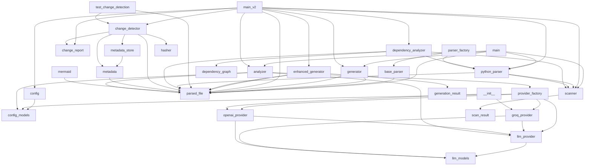

# DocAgent

> 📚 Auto-generated documentation | 2026-04-12

## 📋 Table of Contents

- [Overview](#overview)
- [Architecture](#architecture)
- [Entry Points](#entry-points)
- [Module Relationships](#module-relationships)
- [Design Patterns](#design-patterns)
- [Getting Started](#getting-started)

---

## Overview

This project generates comprehensive documentation for Python projects by analyzing code structure, dependencies, and using language models to provide insights, with the goal of automating the creation of high-quality documentation

## Architecture

The project is structured into several modules, including analysis, generation, core, and parsers, with a main orchestrator that coordinates the workflow, and utilizes design patterns such as the factory pattern for creating parser and LLM provider instances

### Module Dependencies



## Entry Points

The following files can be executed directly:

- `main.py`
- `main_v2.py`
- `cli/main.py`

## Module Relationships

Modules connect through imports and function calls, with data flowing from the core scanner and parsers to the analysis modules, and then to the generation modules, which produce the final documentation output

## Design Patterns

- **Factory Pattern**
- **Observer Pattern**
- **Strategy Pattern**

## Getting Started

### Prerequisites

```bash
python >= 3.10
```

### Installation

```bash
# Clone the repository
git clone <repository-url>
cd docagent

# Install dependencies
pip install -r requirements.txt
```

### Usage

```bash
python main.py
```

---

_This documentation was auto-generated by Code Documentation Agent._